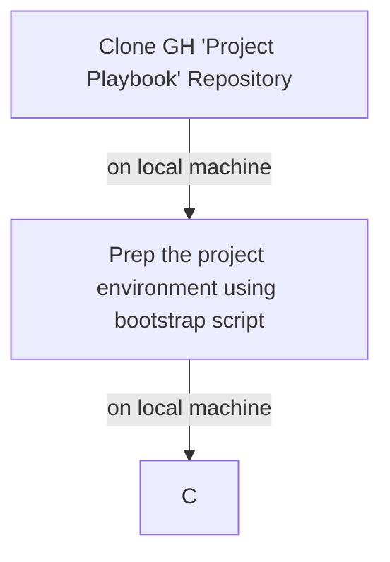

# Project Playbook

## Status
This project is currently in the early stages of development.

## Introduction
Welcome to the Project Playbook! This repository serves as a comprehensive guide for:

- project(s) type scaffolding
- project generator 
- engineering templates

## Repo Map

- assets/         --> Static binaries like `.png`, `.ods` 
- bin/            --> Executable scripts
- bootstrap/      --> Bootstrap scripts
- instructions/   --> Instructional guides
- templates/      --> Various templates for project scaffolding
- .gitignore      --> Git ignore file
- .gitarttributes --> Git LFS attributes file

## Pre-requisites
1.  **Git LFS** installed and configured --> [Git LFS Installation Guide](instructions/git-lfs-installation-guide/git-lfs-installation-guide.md).
  The reason for this is that some of the assets in this repository are large or binary files like (.png, .ods) and Git LFS is designed to handle such files efficiently.

## Logical Flow
The logical flow of the Project Playbook is as follows:




## Getting Started
To get started with the Project Playbook, follow these steps:

1. Clone the repository to your local machine:
   ```bash
   git clone <repository-url>
   ```
2. Navigate to the project directory:
   ```bash
   cd project-playbook
   ```
3. Run bootstrap script to set up the project environment:
   
   - pre-requisites:
      - Ensure you have/know new `project name`
      - Ensure you have/know new `project path full`
   
   ```bash
   ./bootstrap.sh
   ```
4. Follow the instructions:
   - [instruction A](#instruction-a)
   - [instruction B](#instruction-b)

## License
This project is licensed under the MIT License - see the [LICENSE](license.md) file for details.