# Project Playbook

## ToC
1. [Status](#1-status)
2. [Introduction](#2-introduction)
3. [Scope](#3-scope)
4. [Repo Map](#4-repo-map)
5. [Pre-requisites](#5-pre-requisites)
6. [Getting Started](#6-getting-started)
7. [Follow-up Instructions](#7-follow-up-instructions)
8. [Modules Configuration](#8-modules-configuration)
9. [License](#9-license)

---

## 1. Status
This project is currently in the early stages of development.<br>
⚠️**UNDER DEVELOPMENT**⚠️

---

## 2. Introduction
Welcome to the Project Playbook! This repository serves as a comprehensive guide for:

- Local project bootstrapping
- Project scaffolding
- Implementing modules as per the project requirements
  - Angular module
  - Spring Boot module
- GitHub public repository setup and configuration

The user will choose project tech stack and the playbook provides the automated scripts to scaffold the project locally and push the initial code to the GitHub public repository.

Example:
```
bash ./main-root.sh \
   --module bootstrap \
   --module scaffold \
   --module angular \
   --module springboot
```

---

## 3. Scope
> Note: ⚠️ Only for GH public repositories.

---

## 4. Repo Map

- assets/         --> Static binaries like `.png`, `.ods` 
- bin/            --> Executable scripts
- bootstrap/      --> Bootstrap scripts
- instructions/   --> Instructional guides
- templates/      --> Various templates for project scaffolding
- .gitignore      --> Git ignore file
- .gitarttributes --> Git LFS attributes file

---

## 5. Pre-requisites
1. Decide on project name e.g. `my-test-project`
2. Decide on project path full e.g. `/home/user-name/Desktop/projects/my-test-project`
3. Create new GH repository for the project e.g. `my-test-project`
4.  **Git LFS** installed and configured --> [Git LFS Installation Guide](instructions/git-lfs-installation-guide/git-lfs-installation-guide.md).
  The reason for this is that some of the assets in this repository are large or binary files like (.png, .ods) and Git LFS is designed to handle such files efficiently.

---

## 6. Getting Started
To get started with the Project Playbook, follow these steps:

1. Create a new GitHub repository [Link] 
2. As per the pre-requisites, ensure you have:
   - a project name (e.g. `my-test-project`)
   - a project path for local use (e.g. `/home/user-name/Desktop/projects/my-test-project`)
   - a GitHub repository created for the project (e.g. `my-test-project`)
   - Git LFS installed and configured
3. Clone this repository to your local machine:
   ```bash
   git clone https://github.com/DevOn90/project-playbook.git
   ```
4. Run the bootstrap script to set up the project environment:
   ```bash
   cd /path/to/project-playbook
   bash ./bin/main-root.sh \
       --module bootstrap \
       --module scaffold \
       --module angular \
       --module springboot
   ```

### 6.1 Create a Github public repository

1. Open Github repositories [page](https://github.com/DevOn90?tab=repositories)
2. Click on the `New` button to create a new repository.
3. Enter the repository name (e.g. `my-test-project`).
4. Add README.md file
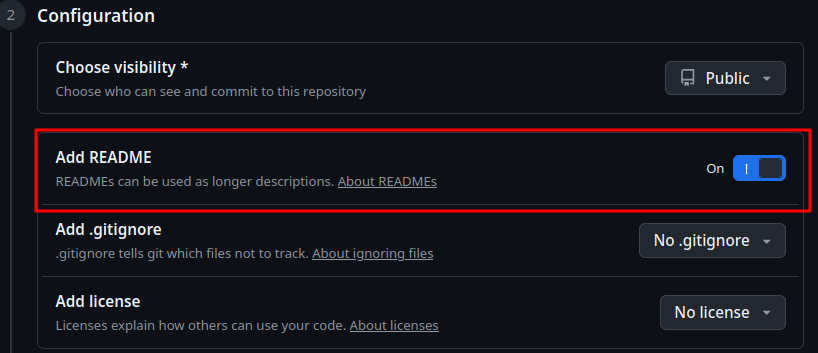
5. Click on `Create repository` button to create the new repository.   

---

## 7. Follow-up Instructions

The script is designed to automate majority of the setup process, but there are a few follow-up instructions to ensure everything is configured correctly:

- **Bootstrap** - `No follow-up` instructions required.
- **Scaffold** - `No follow-up` instructions required.
- **Angular** - `No follow-up` instructions required.
- **Github/public-repo** - [Link](#71-github-public-repo-setup-instructions)

### 7.1 Github Public Repo Setup Instructions

#### 7.1.1 Project View Board

Change default field:
- `ToDo` --> `Backlog`
- `Done` --> `Closed`
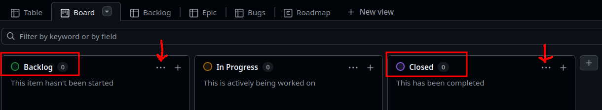

#### 7.1.2 Project View Backlog
- Add filter `status:Backlog -label:dependencies`
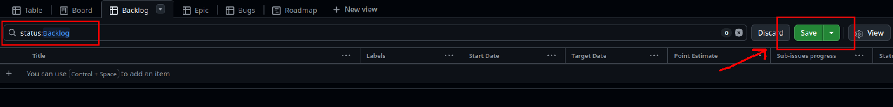
- Click on `Save as` to save the filter for future use.

#### 7.1.4 Project View Epic
- Add filter `label:epic`
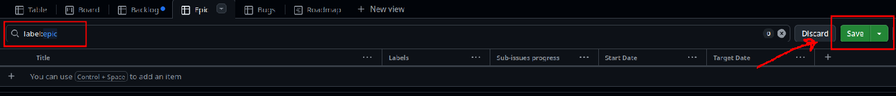
- Click on `Save as` to save the filter for future use.

#### 7.1.5 Project View Bug
- Add filter `label:bug`
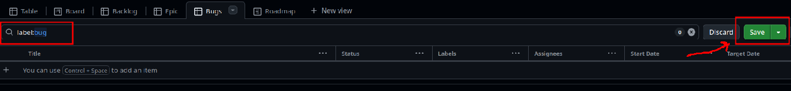
- Click on `Save as` to save the filter for future use.

#### 7.1.6 Project View Reoccurring
- Add filter `no:closed label:reoccurring`
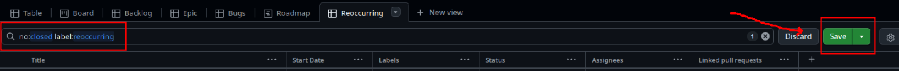
- Click on `Save as` to save the filter for future use.

#### 7.1.7 Project View Dependencies
- Add filter `no:closed label:dependencies`
- Click on `Save as` to save the filter for future use.

#### 7.1.7 Project View Roadmap

**A)** Add iterations to `Sprint` field
   - Go to Roadmap view
   - Click on `three dots` top left corner
   - Select `settings` from the dropdown
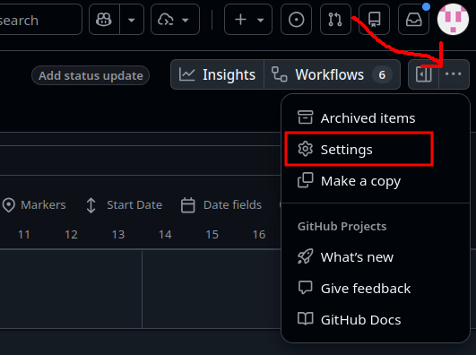
   - Click on `Sprint` in custom fields section right side
   - Click on `Add iteration` button
   - Every click on `Add iteration` will add a new iteration to the list based on cadence.
   - If you want to change cadence, click on `More options` 
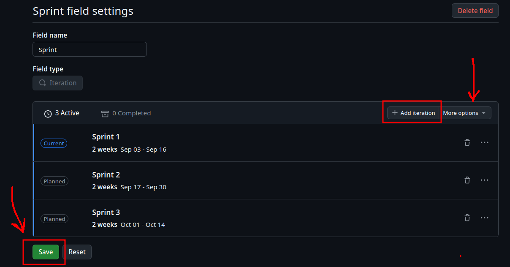
   - Click on `Save` button to save the changes.

**B)** Start & Target Date
   - Go to Roadmap view
   - Click in `Date fields` and select `Start Date` and `Target Date`
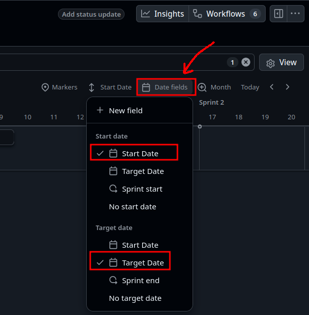
   - To show the date fields click `View` and select `Show date fields` 
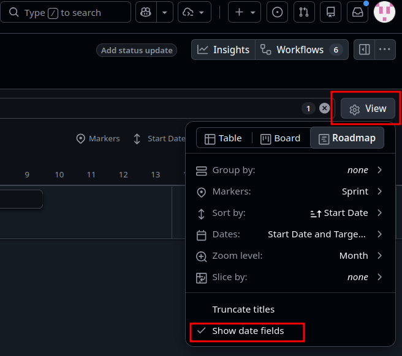

**C)** Set Marker to Sprint
   - Go to Roadmap view
   - Click on `View` select `Markers` and select `Sprint`
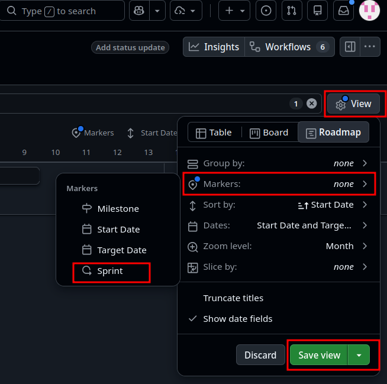
   - Click on `Save View` to save the changes.

**D)** Sort by `Start Date`
   - Go to Roadmap view
   - Click on `Start Date` and select `Start Date`
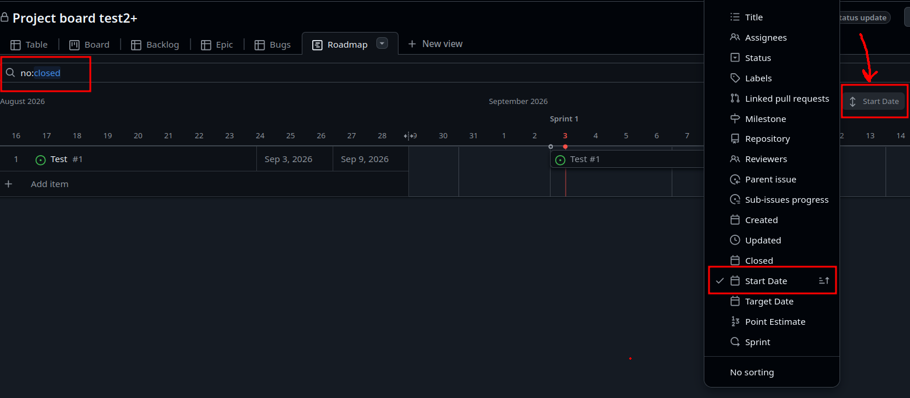
   - Go to search bar and add filter `no:closed` to show only open issues.
   - Click `Save` button to save the changes.

---

#### 7.1.8 Dependabot malware alerts
- Go to repository `Settings`
- Select `Advanced Security` from left side menu
- Click on `Enable` button for `Dependabot malware alerts`

---

#### 7.1.9 Project Workflow Auto-add to project
- Go to repository and click on `Projects` tab
- Click on `Workflows` top right corner
- Click on `Auto-add to project` and click `Edit`
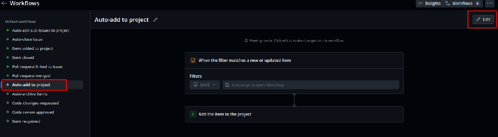
- Filter on `Project`
- Add to search bar `is:issue,pr`
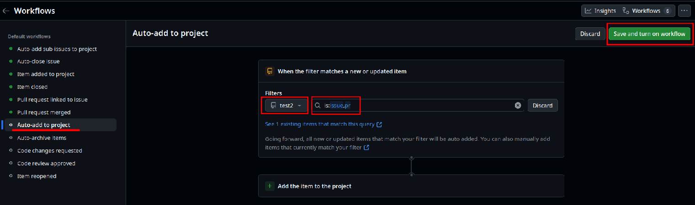
- Click `Save and turn on workflow` button to save the changes.

---

#### 7.1.10 Update Required status checks to pass

- Go to repository `Settings`
- Select `Ruleset` from left side menu
- Click on `branch-main-protection` rule
- Scroll down to `Required status checks` section
- Update the `Require status checks to pass before merging` section to include the following checks:
  - `build/build`
  - `test/test`
  - `lint/lint`
  - `npm-audit/npm-audit`
  - any other checks that are relevant to your project.

---

#### 7.1.11 Allow third-party actions & SHA pinned actions

**A)** Allow third-party actions
- Go to repository `Settings`
- Select `Actions/general` from left side menu
- Add to `Allow or block specified actions and reusable workflows` section third-party actions (e.g. dorny/paths-filter@v3,) and click on `Save` button to save the changes.

**Note:** Action created by Github are allowed by `Allow actions created by GitHub`, hence no need to add them in the list (e.g. actions/checkout@v3, actions/setup-node@v3).

**B)** SHA pinned actions
- Create new Issue title `chore: SHA pinned actions`
- Create branch `chore: sha-pinned-actions` from main branch
- Search in `./.github/workflows` folder for all actions (e.g. actions/checkout@v4)
- In browser, search `github actions/checkout@v4` will guide you to `https://github.com/actions/checkout`
- Open link and click on `Releases` tab
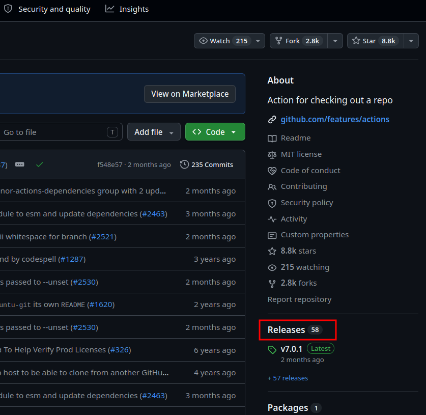
- Click on `Tags` tab
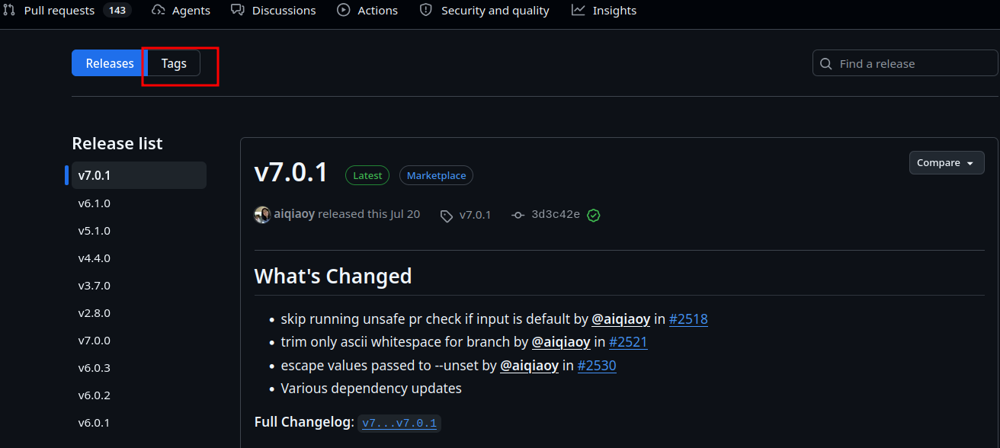
- Find version applied in the workflow (e.g. v4) and click on it
- Click on `Sha` link
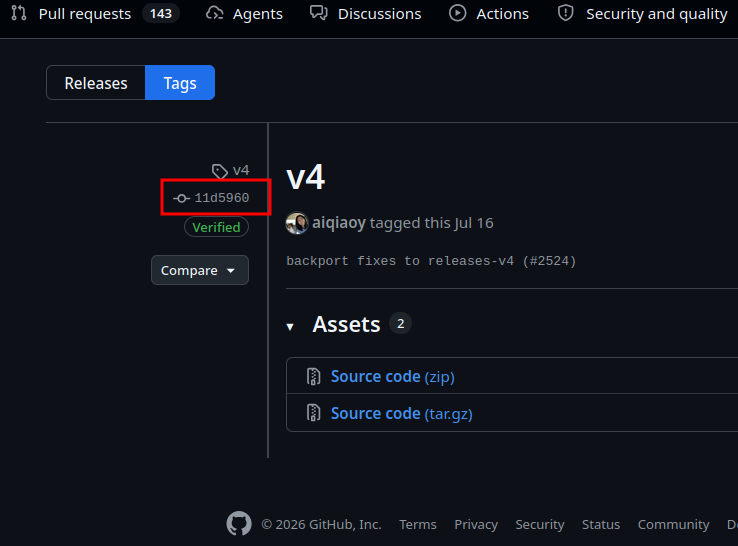
- Copy the `SHA` value from `URL`
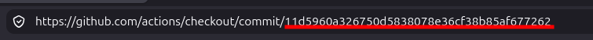
- Go to the workflow file and replace the action version with `SHA` value (e.g. actions/checkout@`<SHA>`).
Example: (keep comment with ref to version of sha)
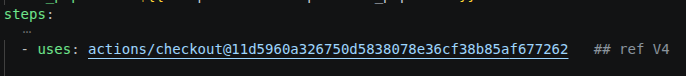
- ⚠️WARNING⚠️ Make sure that the SHA values are applied to `Allow or block specified actions and reusable workflows` for third-party actions in the repository settings. Otherwise, the workflow will fail to run (Ref.: 7.1.12). 
- Repeat the steps for all actions in the workflow files.
- Commit the changes and create a pull request to merge the changes to main branch.
- Merge the pull request to main branch.

---

#### 7.1.12 Dependabot.yml configuration
Note: Repository main branch is `protected`
- Create new Issue title `chore: Dependabot.yml configuration`
- Create branch `chore: dependabot-yml-configuration` from main branch
- Uncomment or add configuration in `dependabot.yml` file as per the project requirements.  
- Commit the changes and create a pull request to merge the changes to main branch.
- Click on `Merge pull request` button to merge the changes to main branch.


---

## 8. Modules Configuration
This chapter provides details of the configuration for each module in project-playbook.

- 8.1 Bootstrap [Link](#81-bootstrap-configuration)
- 8.2 Scaffold [Link](#82-scaffold-configuration)
- 8.3 Angular [Link](#83-angular-configuration)
- 8.X Github/public-repo [Link](#8x-githubpublic-repo-configuration)

### 8.1 Bootstrap Configuration

The bootstrap module is responsible to set up the initial project environment, including Git configuration, Git LFS validation, and other essential setup tasks listed below.

#### 8.1.1 Setup project environment
- Git config user.name (default: `me`)
- Git config user.email (default: `me@example.com`)

#### 8.1.2 Validate GitLFS installation
- Git LFS is required for handling large files in the repository.

#### 8.1.3 Validate local installation of uv (Astral)
- uv (Astral) is a tool used for project scaffolding and automation.

#### 8.1.4 Github hook configuration
- Git hooks are scripts that run automatically on certain git events.  Path is set to `./.githooks`.


---

### 8.2 Scaffold Configuration

The scaffold module is responsible to create the initial project structure and files based on pre-defined templates. The templates does contain folders and files structure as well as files content, where applicable. For empty folders, a `.gitkeep` file is created to ensure that the folder is tracked by Git.

Scaffolding is done in three steps:
1. Create project structure and text files based on templates.
2. Create `binary` files based on templates.
3. Make scripts executable.

Example of L1 folder structure created by the scaffold module:
```text
project-root
.
├── apps
├── docs
├── .githooks
├── .github
├── .gitignore
├── infra
├── logs
├── README.md
├── scripts
└── .vscode
```

Further details of folder structure and files content can be found in `project-playbook/templates` folder. 


---

### 8.3 Angular Configuration

This module is responsible to setup and configure Angular project in the `apps` folder. Details of configuration can be found in [README.md](./modules/angular/README.md) file.

---

### 8.X Github/Public-Repo Configuration

This module is responsible to setup Github public repository for the project. Details of configuration can be found in [README.md](./modules/github/public-repo/README.md) file. 


---

## 9. License
This project is licensed under the MIT License - see the [LICENSE](license.md) file for details.