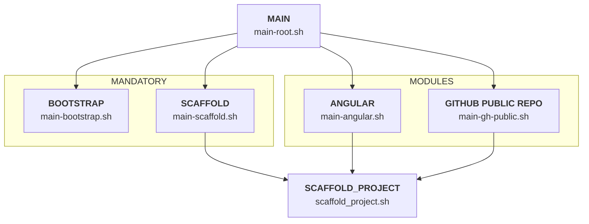

# System Architecture [Draft]

```mermaid
flowchart TD
    A[<b>MAIN</b><br>main-root.sh]
    subgraph MANDATORY
        B[<b>BOOTSTRAP</b><br>main-bootstrap.sh]
        C[<b>SCAFFOLD</b><br>main-scaffold.sh]
    end
    subgraph MODULES
        direction TB
        D[<b>ANGULAR</b><br>main-angular.sh]
        E[<b>GITHUB PUBLIC REPO</b><br>main-gh-public.sh]
    end
    F[<b>SCAFFOLD_PROJECT</b><br>scaffold_project.sh]

    %% Connections
    A --> B
    A --> C
    A --> D
    A --> E

    %% Scaffold Project Connection
    C --> F
    D --> F
    E --> F
```