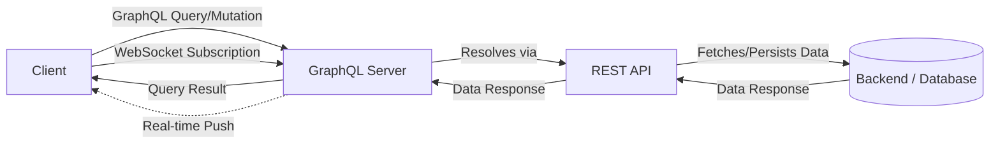

# This is just provision.

I will decide later if i will use this module or not.

Example: (Graphql server with REST API)

```mermaid
graph LR
    C[Client] -->|GraphQL Query/Mutation| A[GraphQL Server]
    C -->|WebSocket Subscription| A
    A -->|Resolves via| B[REST API]
    B -->|Data Response| A
    A -->|Query Result| C
    A -.->|Real-time Push| C
    B -->|Fetches/Persists Data| D[(Backend / Database)]
    D -->|Data Response| B
```